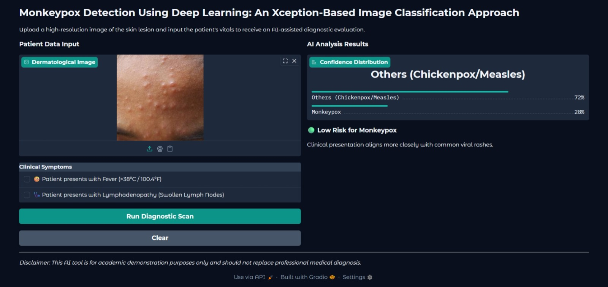

# Monkeypox Detection using Multi-Modal Deep Learning

## Demo


## Overview
This project implements a multi-modal deep learning system that combines image-based features and clinical metadata to simulate real-world medical diagnosis of Monkeypox.

The model integrates a pre-trained Xception convolutional neural network with structured clinical inputs (fever and lymphadenopathy) using a late fusion architecture.

---

## Key Features
- Multi-input neural network combining image and tabular data
- Transfer learning using Xception
- Custom data pipeline for synchronized multi-modal inputs
- Achieves ~91–92% accuracy and 100% recall on test data
- Interactive Gradio-based interface for real-time predictions

---

## Key Insight
Unlike traditional models that rely only on image data, this system integrates clinical symptoms with visual features.

This allows the model to simulate real-world diagnostic reasoning, where both visual examination and patient symptoms are considered before making a decision.

---

## Project Structure
- `app/` – Gradio application  
- `model/` – Training scripts and saved model  
- `evaluation/` – Evaluation and testing scripts  
- `utils/` – Data preprocessing scripts  
- `data/` – Dataset and metadata CSV files  

---

## Model File

The trained model file is not included in this repository due to size constraints.

Download it from:
https://drive.google.com/file/d/1SPjgqz-hum-Ocm6bW4aF2z6-YIuMKiBP/view?usp=sharing

After downloading, place it in:
saved_model/model.h5

---

## Installation
```bash
pip install -r requirements.txt
```

## Running the Application
```bash
python app/app.py
```

## Quick Test
Run the application and upload sample images from:
data/test/

Ensure the model file is present in:
saved_model/model.h5

## Model Training
```bash
python model/train.py
```
## Evaluation
```bash
python evaluation/evaluate.py
```

## Results
* **Accuracy:** ~91–92%
* **Recall (Monkeypox):** 100%
* No false negatives observed in test set

## Notes
* Clinical metadata used in this project is synthetically generated to simulate real-world diagnostic conditions.
* This project is intended for academic and research purposes only and should not be used for medical diagnosis.